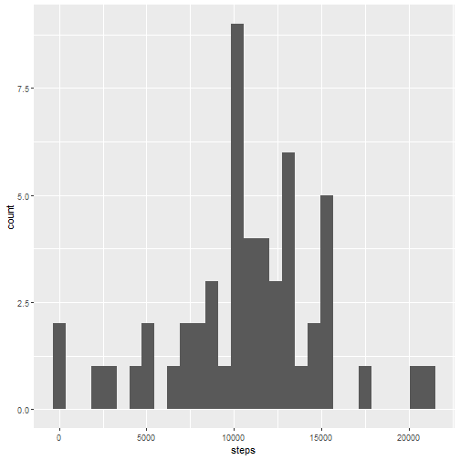
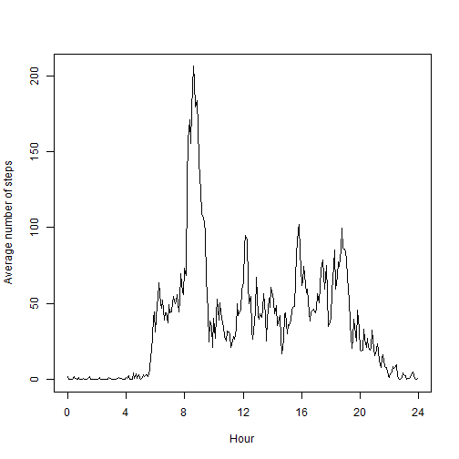
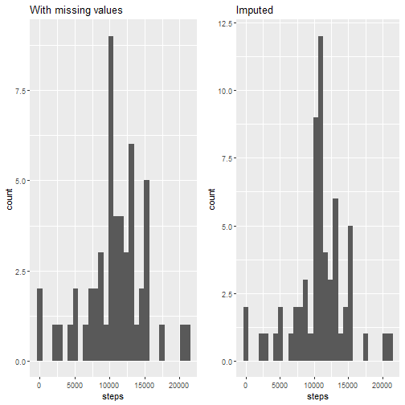
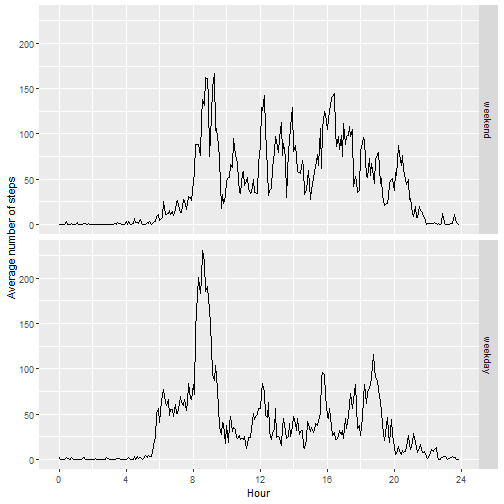

It is now possible to collect a large amount of data about personal
movement using activity monitoring devices such as a
[Fitbit](http://www.fitbit.com), [Nike
Fuelband](http://www.nike.com/us/en_us/c/nikeplus-fuelband), or
[Jawbone Up](https://jawbone.com/up). These type of devices are part of
the "quantified self" movement -- a group of enthusiasts who take
measurements about themselves regularly to improve their health, to
find patterns in their behavior, or because they are tech geeks. But
these data remain under-utilized both because the raw data are hard to
obtain and there is a lack of statistical methods and software for
processing and interpreting the data.

This assignment makes use of data from a personal activity monitoring
device. This device collects data at 5 minute intervals through out the
day. The data consists of two months of data from an anonymous
individual collected during the months of October and November, 2012
and include the number of steps taken in 5 minute intervals each day.


We begin by loading the dataset:


```r
download.file('https://d396qusza40orc.cloudfront.net/repdata%2Fdata%2Factivity.zip','actmon.zip')
unzip('actmon.zip')
actmon <- read.csv('activity.csv')
summary(actmon)
```

```
##      steps            date              interval     
##  Min.   :  0.00   Length:17568       Min.   :   0.0  
##  1st Qu.:  0.00   Class :character   1st Qu.: 588.8  
##  Median :  0.00   Mode  :character   Median :1177.5  
##  Mean   : 37.38                      Mean   :1177.5  
##  3rd Qu.: 12.00                      3rd Qu.:1766.2  
##  Max.   :806.00                      Max.   :2355.0  
##  NA's   :2304
```

 First, we turn the ``interval" column into a new column of class *times*.


```r
library(chron)
actmon$time <- paste0(formatC(actmon$interval,width = 4, flag = '0'),'00')
actmon$time <- times(actmon$time,format = 'hms')
```

Let us look at the distribution of the number of steps taken each day, and calculate the mean and median.


```r
library(ggplot2)
stepsperday <- aggregate(actmon,steps~date,sum)
ggplot(stepsperday,aes(steps)) + geom_histogram()
```

```
## `stat_bin()` using `bins = 30`. Pick better value with `binwidth`.
```



```r
summary(stepsperday$steps)[c(3,4)]
```

```
##   Median     Mean 
## 10765.00 10766.19
```

Next, we look at the average daily activity.


```r
meansteps <- aggregate(actmon,steps~time,mean,na.rm = T)
plot(as.numeric(meansteps$time*24),meansteps$steps,type = 'l',xaxp = c(0,24,6), xlab = 'Hour',ylab = 'Average number of steps')
```



Let us see which time interval contains the maximum number of steps on average.


```r
meansteps$time[which.max(meansteps$steps)]
```

```
## [1] 083500
```

Let us take a look at the missing value in our dataset: 


```r
paste('Missing values:',sum(is.na(actmon$steps)))
```

```
## [1] "Missing values: 2304"
```

```r
nas <- aggregate(actmon,is.na(steps)~date,sum)
names(nas)[2] <- 'missing'
nas[nas['missing'] != 0,]
```

```
##          date missing
## 1  2012-10-01     288
## 8  2012-10-08     288
## 32 2012-11-01     288
## 35 2012-11-04     288
## 40 2012-11-09     288
## 41 2012-11-10     288
## 45 2012-11-14     288
## 61 2012-11-30     288
```

Since the missing data is of entire days, we shall replace each missing value with the mean of the corresponding time interval.


```r
actmonimp <- actmon
for (i in which(is.na(actmon$steps))){
  actmonimp$steps[i] <- meansteps$steps[meansteps$time == actmon$time[i]]
} 
```

With the imputed dataframe, let us recalcuate the distribution of the total number of steps per day.


```r
library(gridExtra)
stepsperdayimp <- aggregate(actmonimp,steps~date,sum)
plot1 <- ggplot(stepsperday,aes(steps)) + geom_histogram() + ggtitle('With missing values')
plot2 <- ggplot(stepsperdayimp,aes(steps)) + geom_histogram() + ggtitle('Imputed')
grid.arrange(plot1,plot2,ncol = 2)
```

```
## `stat_bin()` using `bins = 30`. Pick better value with `binwidth`.
## `stat_bin()` using `bins = 30`. Pick better value with `binwidth`.
```



```r
summary(stepsperdayimp$steps)[c(3,4)]
```

```
##   Median     Mean 
## 10766.19 10766.19
```

Finally, let us see the difference in daily activity between weekdays and weekends.


```r
actmonimp$date <- dates(actmonimp$date,format = 'Y-m-d')
actmonimp$weekend <- factor(weekdays(actmonimp$date) %in% c('Sat','Sun'),levels = c(T,F),labels = c('weekend','weekday'))

meansteps <- aggregate(actmonimp,steps~time + weekend,mean)
ggplot(meansteps,aes(x = time*24,y = steps)) + geom_line() + facet_grid(rows = 'weekend') + scale_x_continuous(breaks = seq(0,24,by = 4)) + xlab('Hour') + ylab('Average number of steps')
```


